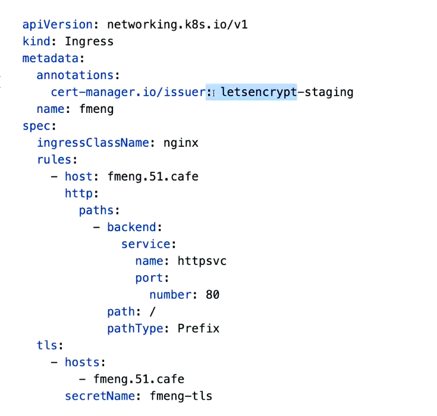
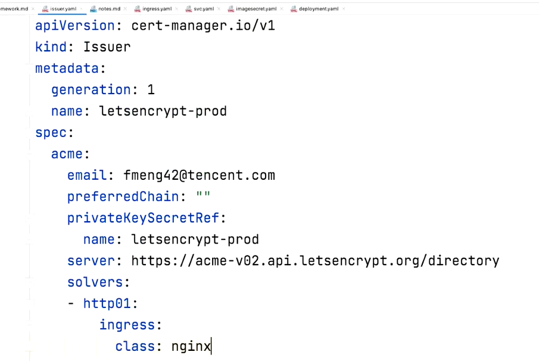
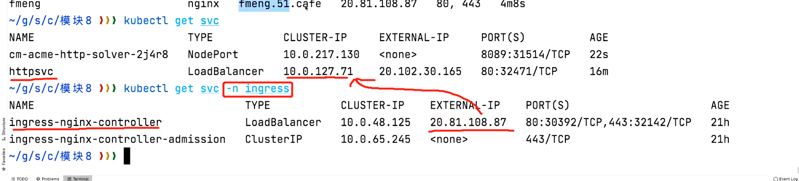

- Ingress + 证书认证
    - 基于ingress-nginx controller
        - 创建ingress-nginx controller
            - 
        - 创建证书 （个人项目可以使用cert-manager），
            - 需要首先配issuer,letsencrypt在里面要先解析一下你的域名是否合法或者是否已经做了IP解析，可以把issuer看做letsencrypt的载体
                - 
        - 创建ingress （域名指向的service的ClusterIP）
            - 