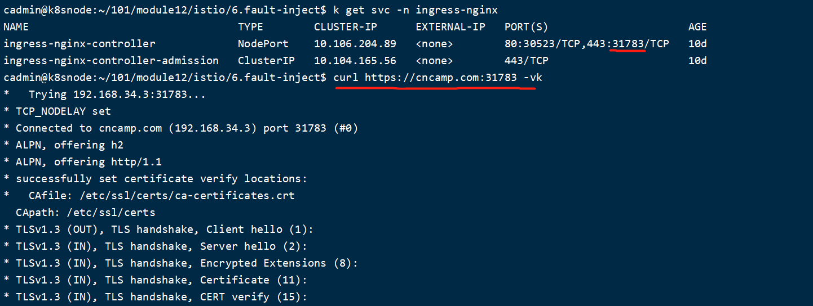

References: k8s/web-deployment.yaml、web-service.yaml

  - （1）优雅终止

    ```go
    <-quit
    log.Println("Shutting down server...")
    // The context is used to inform the server it has 5 seconds to finish
    // the request it is currently handling
    ctx, cancel := context.WithTimeout(context.Background(), 5*time.Second)
    //defer cancel()
    defer func() {
        // extra handling here
        cancel()
    }()
  
    if err := productRouter.Shutdown(ctx); err != nil {
        log.Fatalf("productRouter forced to shutdown:%+v", err)
    }
    log.Println("productRouter Exited Properly")
  
    if err := healthyServer.Shutdown(ctx); err != nil {
        log.Fatalf("healthyServer forced to shutdown:%+v", err)
    }
    log.Println("healthyServer Exited Properly")
    ```

  - （2）优雅启动 / 探活 

    ```yaml
              livenessProbe: # 存活检查，检查容器是否正常，不正常则重启实例
                httpGet: # HTTP请求检查方法
                  path: /healthz # 请求路径，根据返回的code判断是否成功探活
                  port: 8082 # 检查端口
                  scheme: HTTP # 检查协议
                initialDelaySeconds: 10 # 启动延时，容器延时启动健康检查的时间
                periodSeconds: 5 # 间隔时间，进行健康检查的时间间隔
                successThreshold: 1 # 健康阈值，表示后端容器从失败到成功的连续健康检查成功次数
                failureThreshold: 2 # 不健康阈值，表示后端容器从成功到失败的连续健康检查成功次数
                timeoutSeconds: 3 # 响应超时，每次健康检查响应的最大超时时间
              readinessProbe: # 就绪检查，检查容器是否就绪，不就绪则停止转发流量到当前实例
                httpGet:
                  ### this probe will fail with 404 error code
                  ### only httpcode between 200-400 is retreated as success
                  path: /healthz
                  port: 8082
                  scheme: HTTP
                initialDelaySeconds: 10
                periodSeconds: 5
                successThreshold: 2
                failureThreshold: 2
                timeoutSeconds: 3
              startupProbe: # 启动探针，可以知道应用程序容器什么时候启动了
                httpGet:
                  path: /healthz
                  port: 8082
                  scheme: HTTP
                initialDelaySeconds: 1  # 比livenessProbe早执行
                periodSeconds: 10  # ！应用程序有failureThreshold * periodSeconds的时间启动，频度比livenessProbe要低
                successThreshold: 1
                failureThreshold: 10 # ！
                timeoutSeconds: 3
    ```

  - （3）资源需求 Qos

    ```yaml
              resources: # 资源需求
                limits: # limits用于设置容器使用资源的最大上限,避免异常情况下节点资源消耗过多
                  cpu: "1" # 设置cpu limit，1核心 = 1000m
                  memory: 1Gi # 设置memory limit，1G = 1024Mi
                requests: # requests用于预分配资源,当集群中的节点没有request所要求的资源数量时,容器会创建失败
                  cpu: 250m # 设置cpu request
                  memory: 500Mi # 设置memory request
    ```

  - （4）命令行设置log level / 代码配置分离 / 身份授权（基于Secret的basic auth）

    ```yaml
            - command:
                - /bin/httpserver
                - --debug=1 # 如果不设置该参数，需要secret：name=jiac, pwd=3366
              env:
                #身份认证
                - name: name
                  valueFrom:
                    secretKeyRef:
                      name: httpserver-secret
                      key: name
                - name: pwd
                  valueFrom:
                    secretKeyRef:
                      name: httpserver-secret
                      key: pwd
      ```

    

  - （5）服务发布

      - Service NodePort
        

      - Ingress & Ingress-Nginx Controller
        
    
      - [Cert-Manager](deploy%20with%20ingress%20&%20cert-manager.md)

