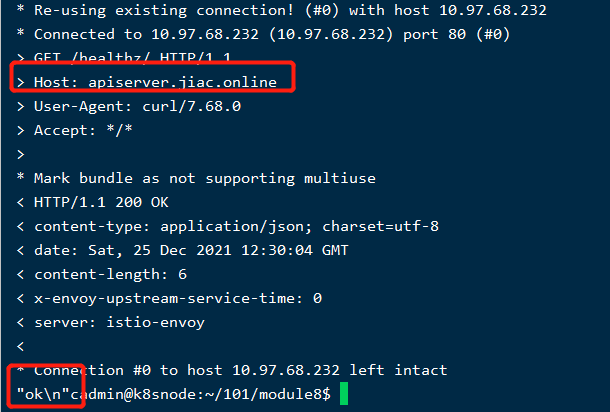
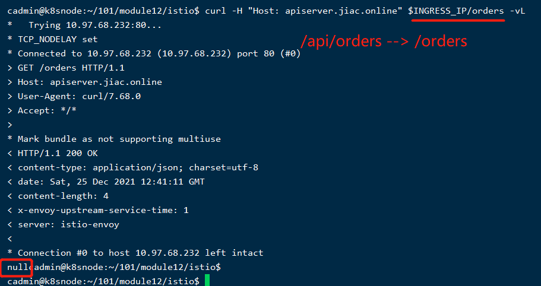

(1) 通过gateway和virtual service  暴露应用服务

$ curl -H "Host: apiserver.jiac.online" $INGRESS_IP/healthz -vL

(2) 7层流量转发:Header/URI rewriting

$ curl -H "Host: apiserver.jiac.online" $INGRESS_IP/orders -vL

(3) HTTPS

$ curl --resolve apiserver.jiac.online:443:$INGRESS_IP https://apiserver.jiac.online/healthz -vkL

(4) canary 灰度发布 精细化流量管控

配置请求路由
｜ 必须遵守某些特定限制，才能利用到 Istio 的 L7 路由特性优势。参考 Pod 和 Service 需求了解详情。
    （1）全部导向某个服务的v1版本   kubectl apply -f samples/bookinfo/networking/virtual-service-all-v1.yaml
        destinationRule把service规划出多个子域subset，；而virtualservices 更像是一些web的匹配规则，指挥哪些流量去哪个subset。
        有gateway的vs做入口做url rewrite  其他的service做精确流量管控（前提是DestinationRule已经创建好，有子域了才能有精确管控啊）

    （2）特定用户导向某服务v2版本   kubectl apply -f samples/bookinfo/networking/virtual-service-reviews-test-v2.yaml
        只有jason用户才能看到v2版本（程序中定义了自定义的end-user 请求头，vs根据这个来分流）

故障注入jason用户流量   
｜ 按照预期，我们引入的 7 秒延迟不会影响到 reviews 服务，因为 reviews 和 ratings 服务（上游服务）间的超时被硬编码为 10 秒。 但是，在 productpage 和 reviews 服务之间（下游服务之间）也有一个 3 秒的硬编码的超时，再加 1 次重试，一共 6 秒。 结果，productpage 对 reviews 的调用在 6 秒后提前超时并抛出错误了。
    （1）注入延迟   kubectl apply -f samples/bookinfo/networking/virtual-service-ratings-test-delay.yaml
    ｜ 上游的超时时间要小于下游（靠近用户侧）的超时时间（单次超时时间 x 重试次数），大概小于0.5~1s
    （2）注入 500 故障  kubectl apply -f samples/bookinfo/networking/virtual-service-ratings-test-abort.yaml

